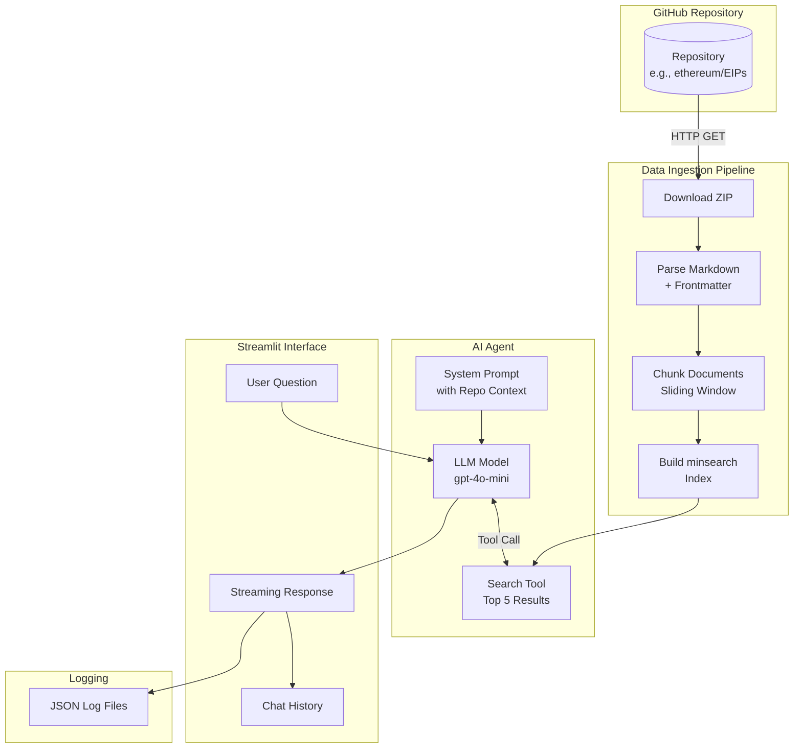
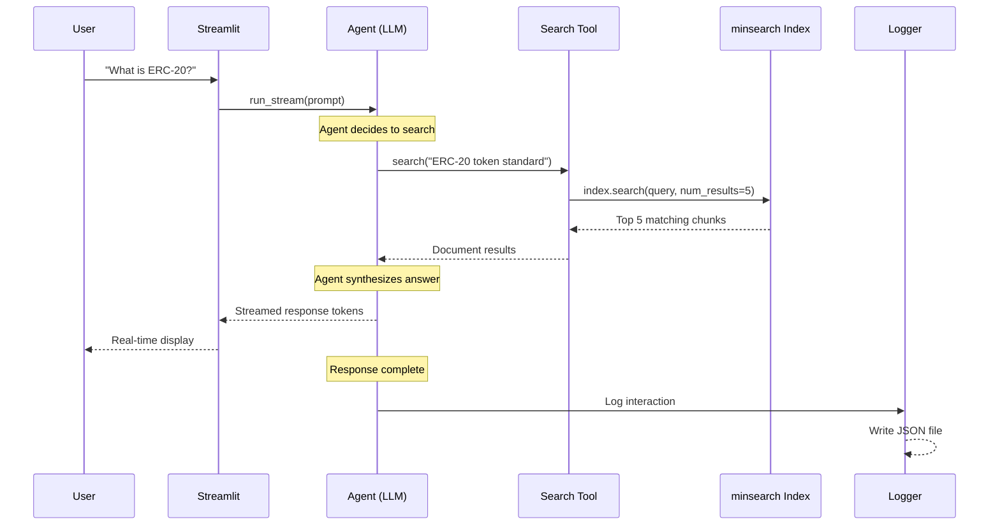

# EIP Specs Agent

An AI-powered question-answering system for Ethereum Improvement Proposals (EIPs). Creates a searchable knowledge base from the EIPs repository and answers questions using RAG (Retrieval-Augmented Generation). Built with **PydanticAI**, **Streamlit**, and **minsearch**.

```
    _____ ___ ____    ____                        _                    _
   | ____|_ _|  _ \  / ___| _ __   ___  ___ ___  / \   __ _  ___ _ __ | |_
   |  _|  | || |_) | \___ \| '_ \ / _ \/ __/ __| / _ \ / _` |/ _ \ '_ \| __|
   | |___ | ||  __/   ___) | |_) |  __/ (__\__ \/ ___ \ (_| |  __/ | | | |_
   |_____|___|_|     |____/| .__/ \___|\___|___/_/   \_\__, |\___|_| |_|\__|
                           |_|                         |___/
```

## Table of Contents

- [Features](#features)
- [Demo](#demo)
- [Architecture](#architecture)
- [Quick Start](#quick-start)
- [Installation](#installation)
- [Configuration](#configuration)
- [Usage Examples](#usage-examples)
- [Project Structure](#project-structure)
- [How It Works](#how-it-works)
- [Evaluation](#evaluation)
- [API Reference](#api-reference)
- [Development](#development)

---

## Features

| Feature | Description |
|---------|-------------|
| **RAG Pipeline** | Downloads, parses, chunks, and indexes repository documentation |
| **AI Agent** | PydanticAI agent with search tool for intelligent Q&A |
| **Streaming UI** | Real-time response streaming via Streamlit |
| **GitHub Citations** | Automatic links to source files in responses |
| **Interaction Logging** | JSON logs for debugging and analysis |
| **Configurable** | Works with any GitHub repository |

---

## Demo

🎥 **Demo video:** [Watch the demo](https://github.com/hitscaleai/eip-specs-agent/releases/download/v0.1.0/eip_specs_agent_release_demo.mov)

### Screenshots


| Chat Interface | Search Results |
|----------------|----------------|
| *Screenshot of chat UI* | *Screenshot showing citations* |

### Sample Interaction

```
User: What is ERC-20?

Agent: ERC-20 is the technical standard for fungible tokens on Ethereum.
It defines a common interface including:

- transfer(to, value) - Transfer tokens
- balanceOf(account) - Check balance
- approve(spender, value) - Approve spending

Reference: [EIPS/eip-20.md](https://github.com/ethereum/EIPs/blob/master/EIPS/eip-20.md)
```

---

## Architecture

### High-Level System Overview

```
┌─────────────────────────────────────────────────────────────────────────────┐
│                           EIP SPECS AGENT SYSTEM                              │
├─────────────────────────────────────────────────────────────────────────────┤
│                                                                              │
│   ┌──────────────┐                                                          │
│   │   GitHub     │                                                          │
│   │   Repository │                                                          │
│   └──────┬───────┘                                                          │
│          │ ZIP Download                                                     │
│          ▼                                                                  │
│   ┌──────────────────────────────────────────────────────────────────────┐  │
│   │                     DATA INGESTION PIPELINE                           │  │
│   │  ┌────────────┐   ┌────────────┐   ┌────────────┐   ┌────────────┐  │  │
│   │  │ Download   │──▶│ Parse MD   │──▶│ Chunk Docs │──▶│ Build      │  │  │
│   │  │ ZIP        │   │ + YAML     │   │ (Sliding   │   │ Index      │  │  │
│   │  │            │   │ Frontmatter│   │  Window)   │   │ (minsearch)│  │  │
│   │  └────────────┘   └────────────┘   └────────────┘   └────────────┘  │  │
│   └──────────────────────────────────────────────────────────────────────┘  │
│                                        │                                    │
│                                        ▼                                    │
│   ┌──────────────────────────────────────────────────────────────────────┐  │
│   │                          AI AGENT LAYER                               │  │
│   │  ┌─────────────────┐    ┌─────────────────┐    ┌─────────────────┐  │  │
│   │  │  System Prompt  │    │   LLM Model     │    │   Search Tool   │  │  │
│   │  │  (Repo Context) │    │  (gpt-4o-mini)  │    │  (Top-5 docs)   │  │  │
│   │  └─────────────────┘    └─────────────────┘    └─────────────────┘  │  │
│   └──────────────────────────────────────────────────────────────────────┘  │
│                                        │                                    │
│                                        ▼                                    │
│   ┌──────────────────────────────────────────────────────────────────────┐  │
│   │                         WEB INTERFACE                                 │  │
│   │  ┌─────────────────┐    ┌─────────────────┐    ┌─────────────────┐  │  │
│   │  │  Chat Input     │───▶│  Stream Output  │───▶│  Save to Logs   │  │  │
│   │  │  (Streamlit)    │    │  (Real-time)    │    │  (JSON files)   │  │  │
│   │  └─────────────────┘    └─────────────────┘    └─────────────────┘  │  │
│   └──────────────────────────────────────────────────────────────────────┘  │
│                                                                              │
└─────────────────────────────────────────────────────────────────────────────┘
```

### Data Flow Diagram



### Agent Interaction Flow



---

## Quick Start

```bash
# 1. Clone the repository
git clone <your-repo-url>
cd ai_hero_course

# 2. Install dependencies with uv
uv sync

# 3. Set your OpenAI API key
export OPENAI_API_KEY="sk-..."

# 4. Run the app
uv run streamlit run app/app.py
```

Open http://localhost:8501 in your browser.

---

## Installation

### Prerequisites

- Python 3.14+
- [uv](https://docs.astral.sh/uv/) package manager
- OpenAI API key

### Step-by-Step Installation

```bash
# Install uv (if not already installed)
curl -LsSf https://astral.sh/uv/install.sh | sh

# Create virtual environment and install dependencies
uv sync

# For development (includes Jupyter)
uv sync --group dev
```

### Dependencies

| Package | Version | Purpose |
|---------|---------|---------|
| `pydantic-ai` | >=1.39.0 | AI agent framework |
| `openai` | >=2.14.0 | LLM provider |
| `minsearch` | >=0.0.7 | BM25 search indexing |
| `streamlit` | >=1.52.2 | Web interface |
| `requests` | >=2.32.5 | HTTP client |
| `python-frontmatter` | >=1.1.0 | YAML metadata parsing |

---

## Configuration

### Environment Variables

| Variable | Default | Description |
|----------|---------|-------------|
| `OPENAI_API_KEY` | *required* | Your OpenAI API key |
| `REPO_OWNER` | `ethereum` | GitHub organization/user |
| `REPO_NAME` | `EIPs` | Repository name |
| `MODEL_NAME` | `gpt-4o-mini` | LLM model to use |
| `AGENT_NAME` | `eip_agent_v1` | Agent identifier for logs |
| `LOGS_DIRECTORY` | `logs` | Directory for interaction logs |

### Streamlit Secrets (for deployment)

Create `app/.streamlit/secrets.toml`:

```toml
OPENAI_API_KEY = "sk-..."
REPO_OWNER = "ethereum"
REPO_NAME = "EIPs"
```

### Using with Different Repositories

```bash
# Example: Index the React repository
export REPO_OWNER="facebook"
export REPO_NAME="react"
uv run streamlit run app/app.py
```

---

## Usage Examples

### Basic Question

```
User: What is ERC-20?

Agent: ERC-20 is a technical standard for fungible tokens on the Ethereum
blockchain. It defines a common interface that all tokens must implement,
including functions like:

- `transfer(to, value)` - Transfer tokens to another address
- `balanceOf(account)` - Get token balance of an account
- `approve(spender, value)` - Approve spending allowance

Reference: [EIPS/eip-20.md](https://github.com/ethereum/EIPs/blob/master/EIPS/eip-20.md)
```

### Follow-up Questions

```
User: How does EIP-1559 change gas fees?

Agent: EIP-1559 introduces a new transaction pricing mechanism with:

1. **Base Fee**: Algorithmically determined, burned instead of going to miners
2. **Priority Fee (Tip)**: Optional tip to incentivize miners
3. **Max Fee**: Maximum total fee user is willing to pay

The base fee adjusts based on network congestion, targeting 50% block utilization.

Reference: [EIPS/eip-1559.md](https://github.com/ethereum/EIPs/blob/master/EIPS/eip-1559.md)
```

### Programmatic Usage

```python
from app.ingest import index_data
from app.search_agent import init_agent

# Build index from repository
index, branch = index_data(
    "ethereum",
    "EIPs",
    chunk=True,
    chunking_params={"size": 2000, "step": 1000}
)

# Create agent
agent = init_agent(index, "ethereum", "EIPs", branch)

# Query the agent
result = await agent.run("What is ERC-721?")
print(result.output)
```

---

## Project Structure

```
eip-specs-agent/
├── pyproject.toml              # Root project configuration
├── README.md                   # This file
├── LICENSE                     # MIT License
├── main.py                     # Root entry point (minimal)
├── uv.lock                     # Dependency lock file
│
├── app/                        # Main application
│   ├── pyproject.toml          # App-specific dependencies
│   ├── app.py                  # Streamlit web interface
│   ├── search_agent.py         # PydanticAI agent configuration
│   ├── search_tools.py         # Search tool for agent
│   ├── ingest.py               # Data ingestion pipeline
│   ├── logs.py                 # Interaction logging
│   ├── main.py                 # App entry point
│   │
│   ├── .streamlit/
│   │   └── secrets.toml        # API keys (gitignored)
│   │
│   └── logs/                   # Interaction logs (JSON)
│       └── *.json
│
├── eval/                       # Evaluation system
│   ├── data_gen.py             # Generate evaluation questions
│   ├── evaluate.py             # LLM-as-judge evaluator
│   ├── questions.json          # Generated Q&A dataset
│   └── results.json            # Evaluation results
│
├── artifacts/                  # Pre-computed data (optional)
│   ├── eip_chunks.json         # Pre-chunked documents
│   └── eip_embeddings.npy      # Pre-computed embeddings
│
└── logs/                       # Root-level logs
```

### Module Responsibilities

```
┌─────────────────────────────────────────────────────────────────────┐
│                          MODULE OVERVIEW                             │
├─────────────────────────────────────────────────────────────────────┤
│                                                                      │
│   app.py                                                            │
│   ├── Streamlit UI setup                                            │
│   ├── Chat interface                                                │
│   ├── Session state management                                      │
│   └── Streaming response handler                                    │
│                                                                      │
│   search_agent.py                                                   │
│   ├── System prompt template                                        │
│   ├── Agent initialization                                          │
│   └── Tool registration                                             │
│                                                                      │
│   search_tools.py                                                   │
│   ├── SearchTool class                                              │
│   └── Index wrapper for agent                                       │
│                                                                      │
│   ingest.py                                                         │
│   ├── GitHub repository download                                    │
│   ├── Markdown + frontmatter parsing                                │
│   ├── Sliding window chunking                                       │
│   └── minsearch index building                                      │
│                                                                      │
│   logs.py                                                           │
│   ├── Log entry creation                                            │
│   ├── Message serialization                                         │
│   └── File persistence                                              │
│                                                                      │
└─────────────────────────────────────────────────────────────────────┘
```

---

## How It Works

### 1. Data Ingestion Pipeline

The system downloads and processes repository documentation:

```
┌─────────────────────────────────────────────────────────────────────┐
│                    INGESTION PIPELINE                                │
├─────────────────────────────────────────────────────────────────────┤
│                                                                      │
│   Step 1: Download Repository                                        │
│   ┌─────────────────────────────────────────────────────────────┐   │
│   │  GET https://codeload.github.com/{owner}/{repo}/zip/...     │   │
│   │                                                              │   │
│   │  Input:  repo_owner="ethereum", repo_name="EIPs"            │   │
│   │  Output: ZIP file in memory                                  │   │
│   └─────────────────────────────────────────────────────────────┘   │
│                              │                                       │
│                              ▼                                       │
│   Step 2: Extract & Parse Markdown                                   │
│   ┌─────────────────────────────────────────────────────────────┐   │
│   │  For each .md/.mdx file in EIPS/ folder:                    │   │
│   │                                                              │   │
│   │  ---                                                         │   │
│   │  eip: 20                                                     │   │
│   │  title: Token Standard        ──▶  Frontmatter metadata     │   │
│   │  author: Vitalik Buterin                                     │   │
│   │  ---                                                         │   │
│   │  # ERC-20                                                    │   │
│   │  A standard interface...      ──▶  Content body             │   │
│   └─────────────────────────────────────────────────────────────┘   │
│                              │                                       │
│                              ▼                                       │
│   Step 3: Chunk Documents (Sliding Window)                           │
│   ┌─────────────────────────────────────────────────────────────┐   │
│   │                                                              │   │
│   │  Original: |=====================================| (5000 ch) │   │
│   │                                                              │   │
│   │  Chunk 1:  |=============|                    (0-2000)       │   │
│   │  Chunk 2:       |=============|               (1000-3000)    │   │
│   │  Chunk 3:            |=============|          (2000-4000)    │   │
│   │  Chunk 4:                 |=============|     (3000-5000)    │   │
│   │                                                              │   │
│   │  50% overlap ensures no information is lost at boundaries   │   │
│   └─────────────────────────────────────────────────────────────┘   │
│                              │                                       │
│                              ▼                                       │
│   Step 4: Build Search Index                                         │
│   ┌─────────────────────────────────────────────────────────────┐   │
│   │  minsearch.Index(text_fields=["content", "path", "filename"])│   │
│   │                                                              │   │
│   │  BM25 ranking algorithm for relevance scoring               │   │
│   │  Indexes: content, file path, filename                       │   │
│   └─────────────────────────────────────────────────────────────┘   │
│                                                                      │
└─────────────────────────────────────────────────────────────────────┘
```

### 2. Agent Query Flow

```
┌─────────────────────────────────────────────────────────────────────┐
│                      AGENT QUERY FLOW                                │
├─────────────────────────────────────────────────────────────────────┤
│                                                                      │
│   User: "What is ERC-20?"                                           │
│                              │                                       │
│                              ▼                                       │
│   ┌─────────────────────────────────────────────────────────────┐   │
│   │  SYSTEM PROMPT                                               │   │
│   │  You are a helpful assistant that answers questions about    │   │
│   │  the repository documentation.                               │   │
│   │                                                              │   │
│   │  Use the search tool to find relevant information before     │   │
│   │  answering. Always include references as GitHub links.       │   │
│   │                                                              │   │
│   │  Base URL: https://github.com/ethereum/EIPs/blob/master/    │   │
│   └─────────────────────────────────────────────────────────────┘   │
│                              │                                       │
│                              ▼                                       │
│   ┌─────────────────────────────────────────────────────────────┐   │
│   │  LLM REASONING                                               │   │
│   │                                                              │   │
│   │  "I need to find information about ERC-20. Let me search."  │   │
│   │                                                              │   │
│   │  Tool Call: search("ERC-20 token standard interface")       │   │
│   └─────────────────────────────────────────────────────────────┘   │
│                              │                                       │
│                              ▼                                       │
│   ┌─────────────────────────────────────────────────────────────┐   │
│   │  SEARCH RESULTS (Top 5)                                      │   │
│   │                                                              │   │
│   │  1. EIPS/eip-20.md - "ERC-20 Token Standard..."             │   │
│   │  2. EIPS/eip-721.md - "...extends ERC-20 concepts..."       │   │
│   │  3. EIPS/eip-1155.md - "...multi-token, unlike ERC-20..."   │   │
│   │  ...                                                         │   │
│   └─────────────────────────────────────────────────────────────┘   │
│                              │                                       │
│                              ▼                                       │
│   ┌─────────────────────────────────────────────────────────────┐   │
│   │  GENERATED RESPONSE                                          │   │
│   │                                                              │   │
│   │  "ERC-20 is a technical standard for fungible tokens..."    │   │
│   │                                                              │   │
│   │  Reference: [EIPS/eip-20.md](https://github.com/...)        │   │
│   └─────────────────────────────────────────────────────────────┘   │
│                                                                      │
└─────────────────────────────────────────────────────────────────────┘
```

### 3. Document Structure

Each indexed document contains:

```python
{
    # Content fields (searchable)
    "content": "# ERC-20 Token Standard\n\nA standard interface...",
    "path": "EIPS/eip-20.md",
    "filename": "EIPs-master/EIPS/eip-20.md",

    # Position (for chunked documents)
    "start": 0,  # Character offset in original

    # Repository metadata
    "repo_owner": "ethereum",
    "repo_name": "EIPs",
    "branch": "master",

    # YAML frontmatter fields
    "eip": 20,
    "title": "Token Standard",
    "author": "Fabian Vogelsteller, Vitalik Buterin",
    "status": "Final",
    "type": "Standards Track",
    "category": "ERC",
    "created": "2015-11-19"
}
```

---

## Evaluation

The project includes an LLM-as-judge evaluation system to assess agent performance.

### Evaluation Criteria

| Criterion | Description |
|-----------|-------------|
| **Relevance** | Does the answer address the user's question? |
| **Accuracy** | Is the information factually correct? |
| **Completeness** | Does it cover all important aspects? |
| **Citations** | Are sources properly referenced? |
| **Clarity** | Is the answer well-structured and clear? |

### Running Evaluations

```bash
# Generate evaluation questions from EIP documents
python eval/data_gen.py --num-questions 50 --output eval/questions.json

# Run evaluation on logged interactions
python eval/evaluate.py --logs-dir app/logs --max-evals 10

# View results
cat eval/results.json | python -m json.tool
```

### Sample Results

```
============================================================
EVALUATION SUMMARY
============================================================

Agent: eip_agent_v1
Interactions Evaluated: 10
Timestamp: 2025-01-16T12:00:00

Pass Rates by Criterion:
----------------------------------------
  Relevance        95.0%
  Accuracy         90.0%
  Completeness     85.0%
  Citations        80.0%
  Clarity          90.0%
----------------------------------------
  Overall          88.0%

============================================================
```

### Evaluation Files

| File | Purpose |
|------|---------|
| `eval/data_gen.py` | Generate Q&A pairs from EIP documents |
| `eval/evaluate.py` | LLM-as-judge evaluation runner |
| `eval/questions.json` | Generated evaluation dataset |
| `eval/results.json` | Evaluation results and metrics |

---

## API Reference

### ingest.py

#### `index_data(repo_owner, repo_name, *, branches, chunk, chunking_params)`

Main entry point for building searchable index.

```python
from app.ingest import index_data

# Basic usage
index, branch = index_data("ethereum", "EIPs")

# With custom chunking
index, branch = index_data(
    "ethereum",
    "EIPs",
    branches=("main", "master"),
    chunk=True,
    chunking_params={"size": 1500, "step": 750}
)
```

#### `read_repo_data(repo_owner, repo_name, **kwargs)`

Download and parse repository.

```python
from app.ingest import read_repo_data

docs, branch = read_repo_data(
    "ethereum",
    "EIPs",
    include_exts=(".md", ".mdx"),
    include_prefixes=("EIPS/",)
)
```

### search_agent.py

#### `init_agent(index, repo_owner, repo_name, branch)`

Create configured PydanticAI agent.

```python
from app.search_agent import init_agent

agent = init_agent(index, "ethereum", "EIPs", "master")

# Query the agent
result = await agent.run("What is EIP-1559?")
print(result.output)

# Stream response
async with agent.run_stream(user_prompt="Explain gas") as stream:
    async for chunk in stream.stream_output():
        print(chunk, end="", flush=True)
```

### logs.py

#### `log_interaction_to_file(agent, messages, source)`

Save interaction to JSON file.

```python
from app.logs import log_interaction_to_file

filepath = log_interaction_to_file(agent, result.new_messages())
print(f"Logged to: {filepath}")
# Output: logs/eip_agent_v1_20240115_143022_a1b2c3.json
```

---

## Development

### Running Tests

```bash
# Run with pytest
uv run pytest

# With coverage
uv run pytest --cov=app
```

### Code Style

```bash
# Format with black
uv run black app/

# Lint with ruff
uv run ruff check app/
```

### Adding New Repositories

1. Update environment variables or secrets:
   ```bash
   export REPO_OWNER="new-org"
   export REPO_NAME="new-repo"
   ```

2. Optionally customize file filters in `ingest.py`:
   ```python
   include_exts=(".md", ".rst", ".txt")
   include_prefixes=("docs/",)
   ```

3. Restart the Streamlit app.

### Extending the Agent

Add new tools by creating a class with callable methods:

```python
# app/custom_tools.py
class SummaryTool:
    def summarize(self, text: str, max_length: int = 100) -> str:
        """Summarize text to specified length."""
        return text[:max_length] + "..."

# Register in search_agent.py
summary_tool = SummaryTool()
agent = Agent(
    tools=[search_tool.search, summary_tool.summarize],
    ...
)
```

---

## Log File Format

Interaction logs are saved as JSON:

```json
{
  "agent_name": "eip_agent_v1",
  "system_prompt": "You are a helpful assistant...",
  "provider": "openai",
  "model": "gpt-4o-mini",
  "tools": ["search"],
  "messages": [
    {
      "kind": "request",
      "parts": [{"content": "What is ERC-20?"}],
      "timestamp": "2024-01-15T14:30:22Z"
    },
    {
      "kind": "response",
      "parts": [{"content": "ERC-20 is a technical standard..."}],
      "timestamp": "2024-01-15T14:30:25Z"
    }
  ],
  "source": "user"
}
```

---

## Troubleshooting

### Common Issues

| Issue | Solution |
|-------|----------|
| `OPENAI_API_KEY not set` | Set via environment or secrets.toml |
| `Failed to download repo` | Check network, verify repo exists and is public |
| `No results found` | Adjust `include_prefixes` to match repo structure |
| `Memory error` | Reduce chunk size or limit included files |

### Debug Mode

```bash
# Enable verbose logging
export STREAMLIT_LOG_LEVEL=debug
uv run streamlit run app/app.py
```

---

## License

MIT License - See LICENSE file for details.

---

## Acknowledgments

- [PydanticAI](https://github.com/pydantic/pydantic-ai) - AI agent framework
- [Streamlit](https://streamlit.io/) - Web application framework
- [minsearch](https://github.com/alexeygrigorev/minsearch) - Lightweight search library
- [Ethereum EIPs](https://github.com/ethereum/EIPs) - Default repository for examples
